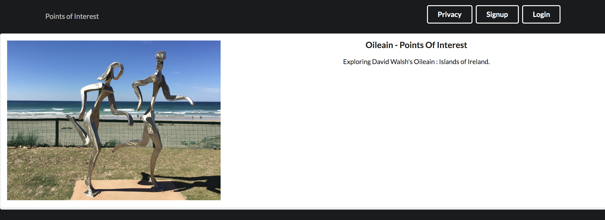

# nodejs-hapi-nunjucks-mongodb-app

POINTS OF INTEREST

Server-Rendered Web Application, release 1:

* [x] Front End [ nunjunks, semantic-ui, jquery ]
* [x] Components [boom, dotenv,, mongoose, mais-mongoose-seeder ]
* [x] Backend. [ hapi, joi, vision, inert ]
* [x] Infrastructure. [ node, mongodb ]

# 

API Web Service, release 2:

* [x] Work in progress
* [-] Boom (https://github.com/hapijs/boom)
